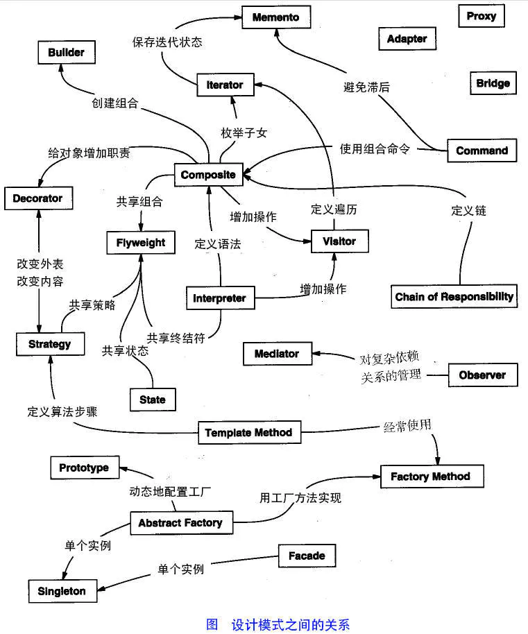

# 设计模式

## 什么是设计模式

设计模式是软件设计中常见问题的典型解决方案。 它们就像能根据需求进行调整的预制蓝图， 可用于解决代码中反复出现的设计问题。

设计模式与方法或库的使用方式不同， 你很难直接在自己的程序中套用某个设计模式。 模式并不是一段特定的代码， 而是解决特定问题的一般性概念。 你可以根据模式来实现符合自己程序实际所需的解决方案。

人们常常会混淆模式和算法， 因为两者在概念上都是已知特定问题的典型解决方案。 但算法总是明确定义达成特定目标所需的一系列步骤， 而模式则是对解决方案的更高层次描述。 同一模式在两个不同程序中的实现代码可能会不一样。

算法更像是菜谱： 提供达成目标的明确步骤。 而模式更像是蓝图： 你可以看到最终的结果和模式的功能， 但需要自己确定实现步骤。

## 模式包含哪些内容
大部分模式都有正规的描述方式， 以便在不同情况下使用。 模式的描述通常会包括以下部分：


- **意图**部分简单描述问题和解决方案。
- **动机**部分将进一步解释问题并说明模式会如何提供解决方案。
- **结构**部分展示模式的每个部分和它们之间的关系。
- **在不同语言中的实现**提供流行编程语言的代码， 让读者更好地理解模式背后的思想。

部分模式介绍中还列出其他的一些实用细节， 例如模式的适用性、 实现步骤以及与其他模式的关系。

## 模式的分类
此外， 所有模式可以根据其意图或目的来分类。 主要分成三种类别：

- **创建型模式**提供创建对象的机制， 增加已有代码的灵活性和可复用性。
- **结构型模式**介绍如何将对象和类组装成较大的结构， 并同时保持结构的灵活和高效。
- **行为模式**负责对象间的高效沟通和职责委派。



下面记录GOF常用的23种设计模式

## 创造型模式
这类模式提供创建对象的机制， 能够提升已有代码的灵活性和可复用性。
创造型模式有5种.

### 工厂方法(Factory Method)

### 抽象工厂(Abstract Factory)

### 生成器(builder)

### 原型(Prototype)

### 单例(Singleton)


## 结构性模式
这类模式介绍如何将对象和类组装成较大的结构， 并同时保持结构的灵活和高效。
结构性模式有7种.

### 适配器(Adapter)

### 桥接(bridge)

### 组合(composite)

### 装饰(Decorator)

### 外观(Facade)

### 享元(flyweight)

### 代理(Proxy)

## 行为模式
这类模式负责对象间的高效沟通和职责委派。
行为模式有10种.

### 责任链(Chain of Responsibility)

### 命令(Comand)

### 迭代器(Iterator)

### 中介者(Mediator)

### 备忘录(Memento)

### 观察者(Observer)
>Define a one-to-many dependency between objects so that when one object changes
state, all its dependents are notified and updated automatically.
在对象间定义一种一对多的依赖关系，当这个对象状态发生改变时，所有依赖它的
对象都会被通知并自动更新。

 
监听模式是一种一对多的关系，可以有任意个（一个或多个）观察者对象同时监听某一个
对象。监听的对象叫观察者（后面提到监听者，其实就指观察者，两者是相同的），被监听的对
象叫被观察者（Observable，也叫主题，即 Subject）。被观察者对象在状态或内容（数据）发生
变化时，会通知所有观察者对象，使它们能够做出相应的变化（如自动更新自己的信息）。

监听模式又名观察者模式，顾名思义就是观察与被观察的关系。比如你在烧开水的时候看
着它开没开，你就是观察者，水就是被观察者；再比如你在带小孩，你关注他是不是饿了，是
不是渴了，是不是撒尿了，你就是观察者，小孩就是被观察者。观察者模式是对象的行为模式，
又叫发布/订阅（Publish/Subscribe）模式、模型/视图（Model/View）模式、源/监听器（Source/Listener）
模式或从属者（Dependents）模式。当你看这些模式的时候，不要觉得陌生，它们就是监听模式。
监听模式的核心思想就是在被观察者与观察者之间建立一种自动触发的关系。

在设计监听模式的程序时要注意以下几点。

- （1）要明确谁是观察者谁是被观察者，只要明白谁是应该关注的对象，问题也就明白了。
一般观察者与被观察者之间是多对一的关系，一个被观察对象可以有多个监听对象（观察者）。
如一个编辑框，有鼠标点击的监听者，也有键盘的监听者，还有内容改变的监听者。

- （2）Observable 在发送广播通知的时候，无须指定具体的 Observer，Observer 可以自己决
定是否订阅 Subject 的通知。

- （3）被观察者至少需要有三个方法：添加监听者、移除监听者、通知 Observer 的方法。观
察者至少要有一个方法：更新方法，即更新当前的内容，做出相应的处理。

- （4）添加监听者和移除监听者在不同的模型称谓中可能会有不同命名，如在观察者模型中
一般是 addObserver/removeObserver；在源/监听器（Source/Listener）模型中一般是 attach/detach，
应用在桌面编程的窗口中还可能是 attachWindow/detachWindow 或 Register/UnRegister。不要被
名称弄迷糊了，不管它们是什么名称，其实功能都是一样的，就是添加或删除观察者。

**应用场景**
>对一个对象状态或数据的更新需要其他对象同步更新，或者一个对象的更新需要依赖
另一个对象的更新。

Apscheduler库中的event处理就借鉴了这种思想.

```python
    # scheduler/base.py
    def add_listener(self, callback, mask=EVENT_ALL):
        with self._listeners_lock:
            self._listeners.append((callback, mask))

    def remove_listener(self, callback):
        with self._listeners_lock:
            for i, (cb, _) in enumerate(self._listeners):
                if callback == cb:
                    del self._listeners[i]
 
    def _dispatch_event(self, event):
        with self._listeners_lock:
            listeners = tuple(self._listeners)

        for cb, mask in listeners:
            # 这里 if 为True表示,事件在add_listener添加了回调函数
            if event.code & mask:
                try:
                    cb(event)
                except BaseException:
                    self._logger.exception('Error notifying listener')                    
```

### 状态(State)

### 策略(Strategy)

### 模板方法(Template Method)

### 访问者(Visitor)


